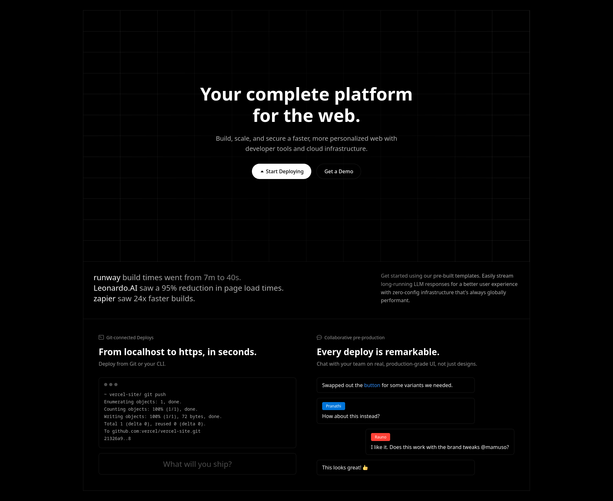

# Mesh Gradient Hero

A modern, dark-themed hero section featuring a controlled grid background, gradient effects, and interactive chat elements.

## Features
- Precise 12-column grid system with subtle lines
- Dark theme with controlled contrast
- Interactive elements and hover states
- Responsive design that maintains grid proportions
- Multi-section layout with seamless connections
- Chat interface with realistic messaging interactions

## Components
1. **Hero Section**
   - Clean typography with optimal contrast
   - Centered content with radial gradient backdrop
   - Custom grid background pattern
   - Call-to-action buttons with hover effects

2. **Metrics Section**
   - Company statistics with emphasis on key numbers
   - Interactive tag system for categories
   - Right-aligned description text
   - Seamless border connections

3. **Features Section**
   - Split-view layout
   - Terminal window with monospace font
   - Interactive chat interface with user badges
   - Preview window with placeholder content

## Styling Techniques
- CSS Grid for layout structure
- Custom background patterns using CSS gradients
- Calculated column widths for precise grid alignment
- Radial gradients for content emphasis
- Border manipulations for connected sections
- Semi-transparent overlays for depth
