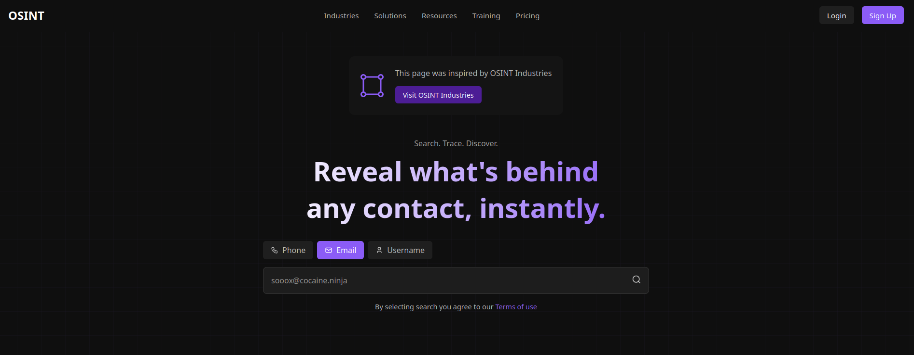

# Neon Search UI

A cyberpunk-inspired search interface featuring a dark theme with neon purple accents, frosted glass effects, and a futuristic grid layout.



## Features

### Visual Design
- Dark theme with neon purple accents
- Animated grid background pattern
- Frosted glass navigation bar
- Gradient text effects
- High-contrast visual hierarchy

### Components
1. **Navigation Bar**
   - Frosted glass effect with blur
   - Responsive menu system
   - Sign up/Login buttons

2. **Announcement Card**
   - Icon integration
   - Call-to-action button
   - Semi-transparent background
   - Responsive layout

3. **Search Interface**
   - Multi-tab search selector (Phone, Email, Username)
   - Custom-styled input field
   - Integrated search icon
   - Visual feedback on interaction
   - Terms of use integration

## Styling Techniques
- CSS Variables for theme customization
- Backdrop-filter for frosted glass effect
- CSS Grid for layout structure
- Gradient overlays for text effects
- SVG icons with consistent styling
- Responsive design principles

## Customization
Easily modify the theme using CSS variables:
```css
:root {
    --primary-purple: #8B5CF6;
    --purple-dark: #4C1D95;
    --text-primary: #FFFFFF;
    --text-secondary: rgba(255, 255, 255, 0.7);
    --background-dark: #0F0F0F;
    --nav-background: rgba(15, 15, 15, 0.8);
    --button-background: #1F1F1F;
}
```

## Usage
1. Clone the repository
2. Open `index.html` in your browser
3. Customize colors and content as needed

## Structure
```
neon-search/
├── index.html
├── style.css
├── README.md
└── screenshot.png
```

## Best Practices
- Semantic HTML structure
- Responsive design for all screen sizes
- Accessible color contrast ratios

## Performance Considerations
- Optimized backdrop-filter usage
- Efficient grid rendering
- Minimal DOM depth
- Responsive image handling

## Accessibility
- ARIA labels for interactive elements
- Keyboard navigation support
- Screen reader friendly structure
- Sufficient color contrast

## Future Enhancements
- Add animation to grid background
- Implement dark/light theme toggle